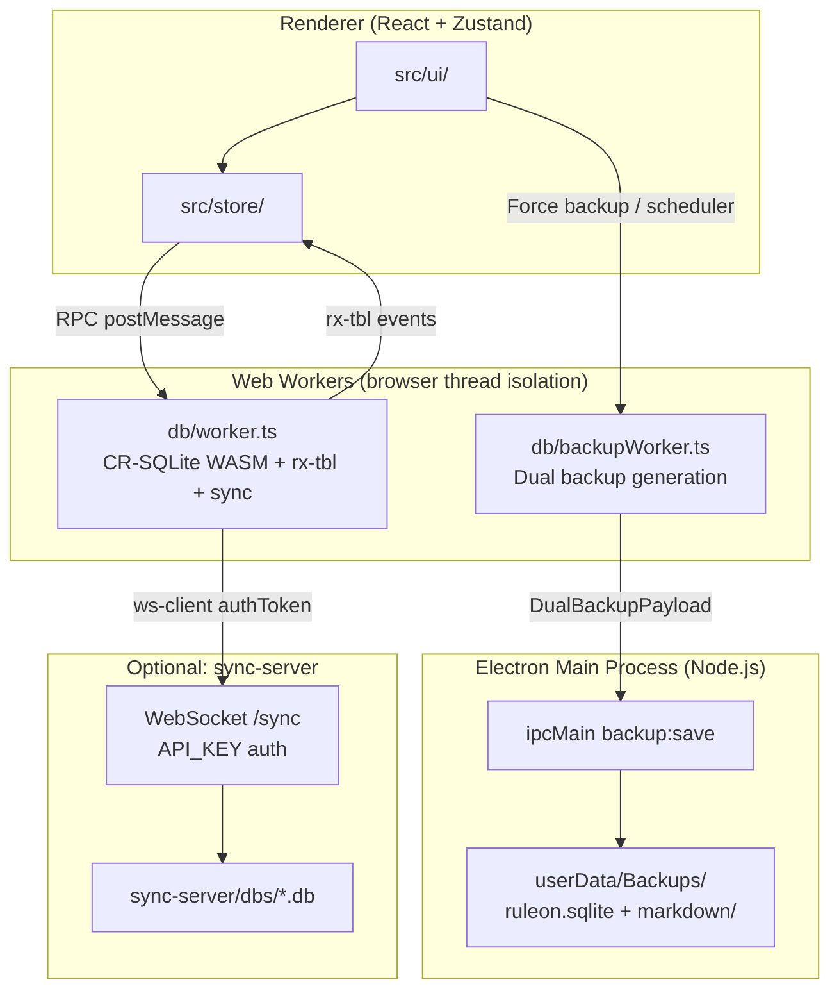

# Ruleon Architecture

Local-first outliner and productivity app (v0.1.0). **React UI** talks to **CR-SQLite** only through **Web Workers**. **Electron** adds a hardened main process for filesystem backup. Optional **WebSocket sync** replicates CRR tables to a small Node sync-server.

## Execution topology



**Data path (notes):** React UI → Zustand store → DB worker RPC → CR-SQLite WASM (IndexedDB / OPFS via wa-sqlite).

**Backup path (Electron only):** UI or scheduler → `backupClient` → **backup worker** (SQLite binary dump + Markdown export) → `window.electronAPI.saveDualBackup` → **IPC** `backup:save` → main process writes `Backups/Backup_YYYY-MM-DD_HH-mm/`.

**Sync path:** DB worker → `@vlcn.io/ws-client` → sync-server WebSocket (`auth` in `sec-websocket-protocol`) → server-side SQLite room DB.

## Layer boundaries

| Layer | Path | Responsibility |
|-------|------|----------------|
| UI | `src/ui/` | Visual components. Props and callbacks only. No SQL. |
| Features | `src/features/` | Pure logic (tree, drag projection, editor extensions). |
| Domain | `src/domain/` | DB workers, schemas, queries/mutations, backup codecs. |
| Store | `src/store/` | Zustand glue; subscribes to `rx-tbl` via `RxBridge`. |
| Modules | `src/modules/` | Optional plugins (sync, backup scheduler, pomodoro). |
| Electron | `electron/` | Window shell, preload bridge, filesystem backup IPC. |
| Sync server | `sync-server/` | WebSocket CR-SQLite replication hub. |

## Rules

1. **200-line file limit** — `npm run check:lines`.
2. **No DB in React** — components never import `@vlcn.io/crsqlite-wasm` or run SQL.
3. **Workers own I/O** — all SQLite access runs in `db/worker.ts` or `db/backupWorker.ts`.
4. **Explicit types** — DB rows and AST shapes live in `src/domain/`.
5. **Update this file** when adding a cross-cutting runtime layer.

## Electron shell

| File | Role |
|------|------|
| `electron/main.ts` | `BrowserWindow` with `contextIsolation`, `sandbox`, no `nodeIntegration`. Handles `backup:save`. |
| `electron/preload.ts` | Exposes `window.electronAPI.saveDualBackup`, `platform`. |
| `electron-builder.yml` | Linux AppImage; icon under `build/icons/`. |

User data (backups): `app.getPath("userData")/Backups/Backup_<timestamp>/`.

## Database workers

### Primary DB worker (`src/domain/db/worker.ts`)

- Loads CR-SQLite WASM, opens `ruleon.db`, applies `schema.sql`, runs migrations.
- RPC surface: `dbClient.ts`, `stmtClient.ts`, `txClient.ts` (renderer never touches WASM directly).
- **Sync** (`workerSync.ts`): `createSyncedDB` with custom status transport; post-connect welcome-page dedupe.
- **Reactivity:** `rxBridge.ts` forwards `rx-tbl` table events to the renderer for store refresh.

### Backup worker (`src/domain/db/backupWorker.ts`)

Separate worker for **dual backup** (no contention with live editing RPC):

1. **SQLite:** `PRAGMA wal_checkpoint` + read wa-sqlite IndexedDB blocks → `Uint8Array`.
2. **Markdown:** `SELECT` root pages → recursive tree walk → Tiptap AST → Markdown (`astToMarkdown.ts`).

Orchestration: `backupClient.ts` checkpoints the main DB worker, spawns backup worker, passes payload to Electron IPC.

Scheduler: `backupScheduler.ts` — every 15 min + debounced 60 s after `outline_nodes` / `block_links` / `kv_state` changes (Electron only).

## CR-SQLite stack

- `@vlcn.io/crsqlite-wasm` — browser SQLite + CR-SQLite extension (in DB worker).
- `@vlcn.io/rx-tbl` — table-level change subscriptions.
- CRR tables: `outline_nodes`, `block_links`, `kv_state` (no FK constraints on CRR tables).
- Schema migration: `ensureSchemaApplied()` client-side; `sync-server/migrateDbs.mjs` server-side.

## Sync server security

Sync-server **requires** `API_KEY` in `sync-server/.env` (see `.env.example`). Without a valid token:

- HTTP routes → **401** (`express` middleware: `Authorization: Bearer …` or `X-API-Key`).
- WebSocket upgrade → **401** (`attachWebsocketServer` authenticate callback; token in `sec-websocket-protocol` as `auth=…`).

**Schema version guard:** clients must send `schema_version` (cryb64 hash of `schema.sql`) on WebSocket handshake — query param, `X-Schema-Version` header, or `sec-websocket-protocol`. Mismatch rejects the upgrade before any CR-SQLite changesets are exchanged.

**Inbox quick-add:** `POST /api/inbox` with `{"text":"…"}` creates a child block on the server-side **Inbox** page; CR-SQLite propagates it to Electron/Android on next sync.

Client: Settings → Sync → **API key** must match server `API_KEY`. Transport sends `authToken` and `schema_version` via `statusTransport.ts`.

```bash
cp sync-server/.env.example sync-server/.env
# edit API_KEY, then:
cd sync-server && npm start
```

## Feature modules (summary)

### Outliner

Hierarchical notes in `outline_nodes`. Fractional `sort_order`, DnD via `@dnd-kit`, one Tiptap editor per focused row.

- **Tasks:** `task_status` column (`NULL` / `TODO` / `DONE`); checkbox in `OutlinerRow`, not inside ProseMirror.
- **WikiLinks:** Tiptap inline atom `[[Page]]`; extracted to `block_links` on persist.
- **Query portals:** Block atom `{{query: Target}}`; `QueryPortalView` + SQL via `getPortalBlocks`; reactive `rx-tbl` on `outline_nodes` / `block_links`.

Key paths: `src/domain/outliner/`, `src/features/outliner/`, `src/features/editor/`, `src/store/outlinerStore.ts`, `src/ui/BlockTree.tsx`.

### Pomodoro

State in CRR `kv_state`; journal logging via `pomodoroLogger.ts`. See `src/modules/pomodoro/`.

## File map

```
src/
  ui/                    React components (Sidebar, BlockTree, QueryPortalView, …)
  store/                 outlinerStore, workspaceStore, settingsStore
  features/              editor, outliner, pomodoro (pure logic)
  domain/
    db/                  worker.ts, backupWorker.ts, backupClient.ts, RPC, schema.sql
    backup/              generateDualBackup, astToMarkdown, exportPageTree, scheduler
    outliner/            queries, mutations, portalQueries
  modules/               sync, backup, pomodoro bootstrap
electron/                main.ts, preload.ts, backupTypes.ts
sync-server/             server.mjs, auth.mjs, migrateDbs.mjs, schemas/
build/icons/             App icon stubs for electron-builder
```

## Public documentation site

User-facing docs (what Ruleon is, features, sync setup) live in a **separate repository**: `ruleon-landing` — static Vite site, read-only for visitors. Not part of this codebase; update manually when shipping releases.

## Release checklist (v0.1.0)

- `npm run lint` — clean
- `npm run test:logic` — unit tests
- `npm run build:electron` — AppImage with icon
- Sync: set `API_KEY` on server and matching key in client settings
- `.gitignore` excludes `*.db`, `sync-server/dbs/`, `.env`
