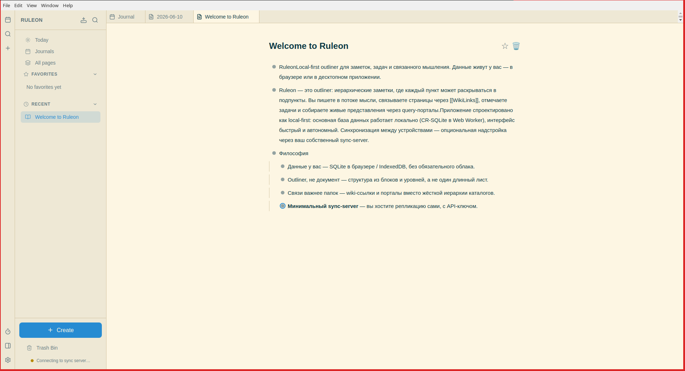

# Ruleon

Local-first outliner built with CR-SQLite, React, and Zustand.



## Setup

```bash
npm install
npm run dev
```

Desktop app (Electron):

```bash
npm run dev:electron
npm run build:electron   # Linux AppImage → release/
```

## Scripts

| Command | Description |
|---------|-------------|
| `npm run dev` | Start dev server |
| `npm run dev:electron` | Electron dev mode |
| `npm run build` | Typecheck and production build |
| `npm run build:electron` | Build Linux AppImage |
| `npm run test` | Unit + E2E tests |
| `npm run check:lines` | Fail if any `src/` file exceeds 200 lines |

See [ARCHITECTURE.md](./ARCHITECTURE.md) for layer boundaries and module map.

If the app shows a CR-SQLite schema error after an earlier failed load, clear site data for `localhost` in your browser (the partial `ruleon.db` must be recreated).
